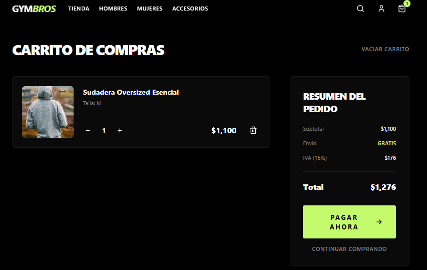
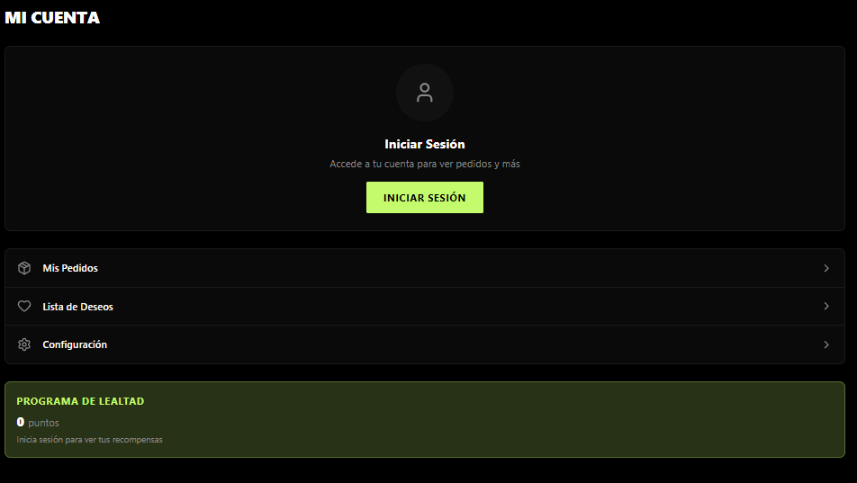

# GymBros - Universal E-commerce App

**GymBros** is a premium gymwear e-commerce application designed for performance and style. Built as a universal app using **Expo**, it delivers a seamless, native-quality experience across Web, iOS, and Android from a single codebase.

## 📱 Mobile & Web Experience

Experience the future of gymwear shopping with our sleek, dark-themed interface accented by our signature "Electric Lime".

### ✨ Key Features

*   **Universal Architecture**: One codebase powering Web, iOS, and Android platforms.
*   **Premium UI/UX**: Modern, dark-mode first design with smooth animations and intuitive navigation.
*   **Complete Shopping Flow**: Browse products, filter by category, manage your cart, and checkout seamlessly.
*   **Account Management**: User authentication, order history, and saved preferences.
*   **Performance**: Optimized for speed and responsiveness using React Native Reanimated.

## 📸 Screenshots

<div align="center">
  
  
</div>
<div align="center">
  
  
</div>

## 🛠️ Tech Stack

*   **Framework**: [Expo SDK 52](https://expo.dev) & React Native
*   **Navigation**: Expo Router (File-based routing)
*   **Styling**: [NativeWind](https://www.nativewind.dev/) (Tailwind CSS for React Native)
*   **Backend**: Supabase (PostgreSQL, Auth)
*   **State Management**: React Context & Async Storage
*   **Icons**: Lucide React Native

## 🚀 Getting Started

To run the project locally:

1.  **Clone the repository**:
    ```bash
    git clone https://github.com/KevinGastelum/GymBros.git
    cd GymBros/gymbros-expo
    ```

2.  **Install dependencies**:
    ```bash
    npm install
    ```

3.  **Start the development server**:
    ```bash
    npx expo start
    ```
    *   Press `w` to open in Web.
    *   Press `i` to open in iOS Simulator.
    *   Press `a` to open in Android Emulator.
    *   Scan QR code with Expo Go app for physical devices.

## 📄 License

This project is licensed under the MIT License - see the [LICENSE](LICENSE) file for details.
